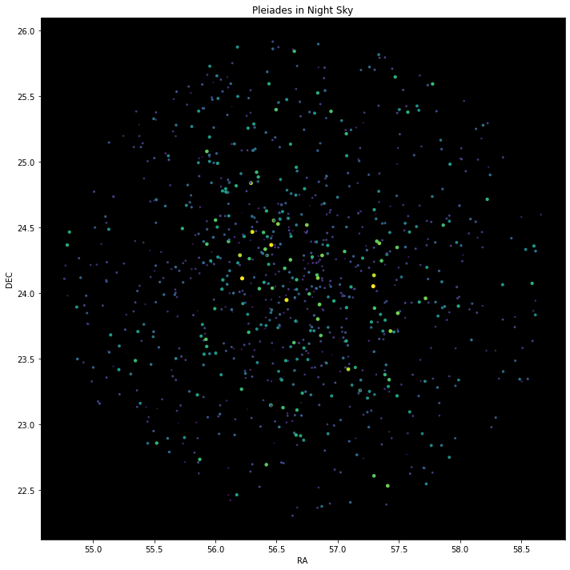

# Summer Project 2021: Computational Astrophysics

## Astronomy Club, SnT Council, IITK
### **This repository is used for submitting assignments related to project and the files used in it.**
 

### Final Project (Case Study: Pleiades Star Cluster)

- final.ipynb
- Final_Project.pdf
- [Pleiades_Cluster.csv](https://github.com/sush14feb/astro-project/blob/main/Final%20Project/Pleiades_Cluster.csv)
- Pleiades_Cluster2.csv 

### WEEK-5 (Astroquery)

  - Astroquery
 

 ### WEEK-4 (Image Processing)

- FITS Handling
 

### WEEK-3 (Time Series Analysis)

- Time Series
- Fourier Transforms
- [Assignment 2](https://github.com/sush14feb/astro-project/blob/main/Assignment-2.ipynb)
 

### WEEK-2 (Scipy and Astropy)

- SciPy
- Astropy
 

### WEEK-1(Python Basics)

- [Assignment1](https://github.com/sush14feb/astro-project/blob/main/Assignment1.ipynb)
- Numpy
- Pandas
- Matplotlib
- Python Basics
 

